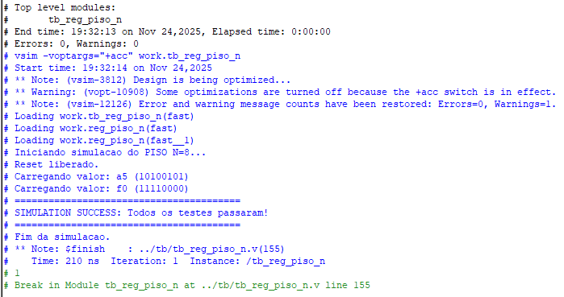
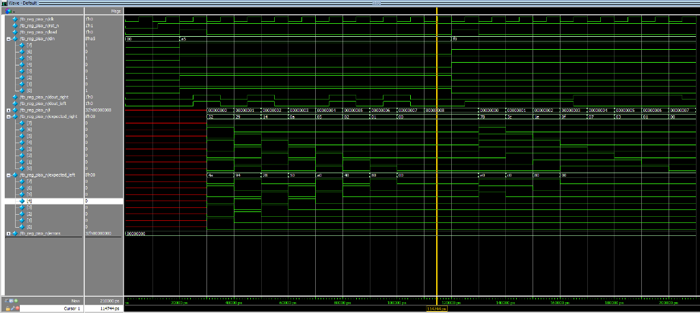

# Relatório de Simulação: Registrador PISO N Bits

**Data:** 24/11/2025  
**Autor:** Manoel Furtado  
**Design:** Registrador PISO (Behavioral, Dataflow, Structural)  

## 1. Resumo dos Resultados
A simulação foi realizada com sucesso utilizando o simulador Questa/ModelSim. O testbench `tb_reg_piso_n` validou corretamente as duas instâncias do registrador (deslocamento à direita e à esquerda) para os padrões de teste aplicados.

**Resultado Final:**  
`SIMULATION SUCCESS: Todos os testes passaram!`

## 2. Análise das Formas de Onda
A análise visual das formas de onda confirma o comportamento esperado do circuito:

1.  **Reset:** O sinal `rst_n` (ativo baixo) inicializa os registradores corretamente.
2.  **Carga Paralela (Load):**
    -   Quando `load` é alto, o valor `0xA5` (10100101) é carregado no registrador na borda de subida do clock.
    -   Posteriormente, o valor `0xF0` (11110000) também é carregado e verificado.
3.  **Deslocamento (Shift):**
    -   **Direita (`dout_right`):** O bit menos significativo (LSB) é o primeiro a sair. A sequência observada corresponde aos bits de `0xA5` lidos da direita para a esquerda.
    -   **Esquerda (`dout_left`):** O bit mais significativo (MSB) é o primeiro a sair. A sequência corresponde aos bits de `0xA5` lidos da esquerda para a direita.
4.  **Comparação Automática:** Os sinais `expected_right` e `expected_left` gerados pelo testbench acompanham perfeitamente as saídas `dout_right` e `dout_left`, resultando em zero erros.

## 3. Conclusão
O design do Registrador PISO atende a todos os requisitos funcionais especificados. A implementação foi validada tanto por verificação automática (self-checking testbench) quanto por inspeção visual das ondas, garantindo robustez para síntese e integração em sistemas maiores.
