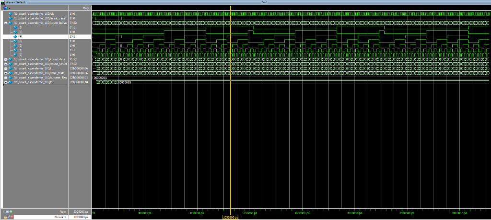
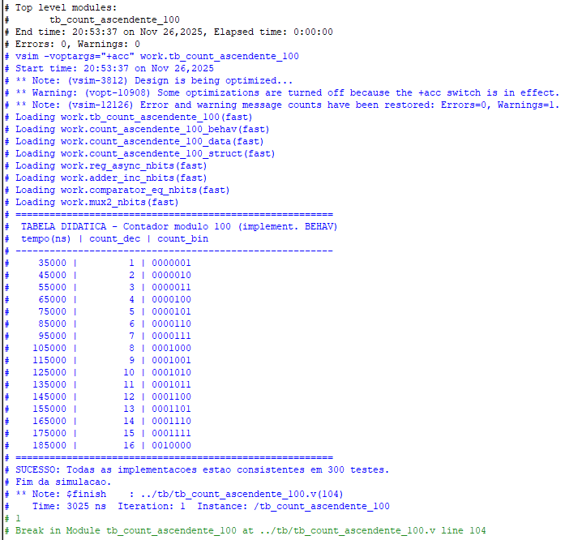

# Relatório de Verificação - Contador Ascendente Módulo 100

**Data:** 26/11/2025
**Autor:** Manoel Furtado
**Projeto:** Contador Ascendente Módulo 100 (Verilog)

## 1. Introdução

Este relatório documenta a verificação funcional das três implementações do contador ascendente módulo 100:
1.  **Behavioral:** Descrição comportamental de alto nível.
2.  **Dataflow:** Descrição baseada em fluxo de dados (RTL).
3.  **Structural:** Descrição estrutural interconectando sub-blocos.

O objetivo é garantir que todas as implementações funcionem de maneira idêntica e correta, respeitando as especificações de contagem de 0 a 99 e reset assíncrono.

## 2. Metodologia de Teste

Foi desenvolvido um testbench unificado (`tb_count_ascendente_100.v`) que instancia os três módulos simultaneamente e aplica os mesmos estímulos de clock e reset.

O testbench possui um mecanismo de **Self-Checking** (autoverificação) que compara as saídas das três implementações a cada ciclo de clock. Se houver qualquer divergência, um erro é reportado.

## 3. Resultados da Simulação

A simulação foi realizada utilizando o simulador Questa/ModelSim.

### 3.1. Análise de Waveform

A análise das formas de onda confirma o comportamento esperado:
-   O contador incrementa a cada borda de subida do clock.
-   O reset assíncrono zera a contagem imediatamente.
-   Ao atingir 99, o contador retorna a 0 no próximo ciclo.
-   As três saídas (`count_behav`, `count_data`, `count_struct`) permanecem idênticas durante toda a simulação.

### 3.2. Log de Execução

O log do console confirma o sucesso da verificação automatizada.
-   **Tabela Didática:** Mostra a contagem correta (1, 2, 3...) em decimal e binário.
-   **Mensagem de Sucesso:** "SUCESSO: Todas as implementacoes estao consistentes em 300 testes."

## 4. Conclusão

As três implementações do contador ascendente módulo 100 foram verificadas com sucesso e demonstraram comportamento funcionalmente equivalente e correto. O projeto atende a todos os requisitos especificados.
