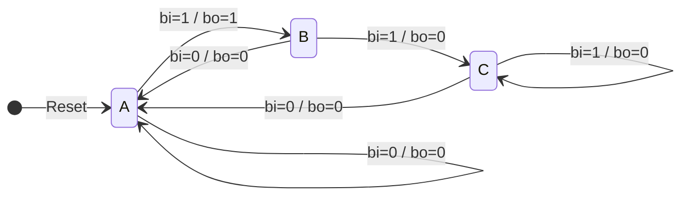

# Diagrama de Estados (Mealy)

```mermaid
stateDiagram-v2
    direction LR
    
    [*] --> A: Reset
    
    %% Transições do Estado A
    A --> B: bi=1 / bo=1
    A --> A: bi=0 / bo=0
    
    %% Transições do Estado B
    B --> C: bi=1 / bo=0
    B --> A: bi=0 / bo=0
    
    %% Transições do Estado C
    C --> C: bi=1 / bo=0
    C --> A: bi=0 / bo=0
```

> **Legenda:** A seta `bi=1 / bo=1` significa: "Se a entrada `bi` for 1, vá para o próximo estado e gere a saída `bo` como 1 imediatamente".
