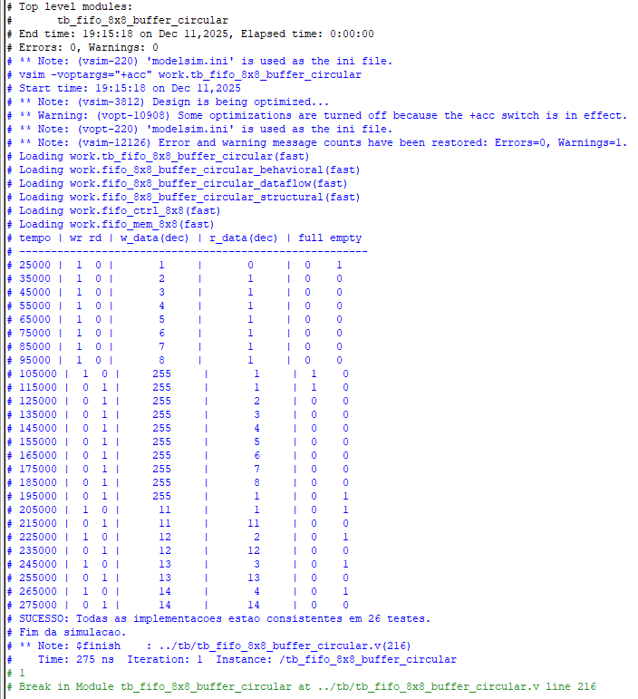
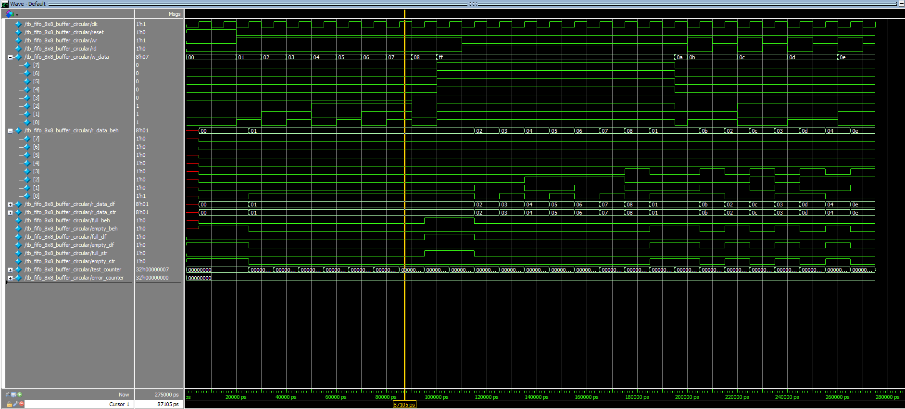

# Relatório de Simulação: FIFO Buffer Circular 8x8

## 1. Introdução
Este relatório apresenta os resultados da simulação funcional do projeto **FIFO 8x8 Buffer Circular**. O objetivo principal foi validar e comparar três diferentes arquiteturas de hardware (Behavioral, Dataflow e Structural) para garantir que todas operam de forma logica e temporalmente equivalente.

## 2. Metodologia de Teste

### 2.1. Arquiteturas
Três abordagens de abstração foram implementadas e testadas simultaneamente:
1.  **Behavioral**: Descrição de alto nível baseada em comportamento algorítmico.
2.  **Dataflow**: Descrição baseada em fluxo de dados e lógica combinacional explícita.
3.  **Structural**: Descrição detalhada interconectando blocos funcionais de Controle e Memória.

### 2.2. Ambiente de Simulação
-   **Ferramenta**: Questa / ModelSim Intel FPGA Edition.
-   **Testbench**: `tb_fifo_8x8_buffer_circular.v` (Testbench Unificado).
-   **Estratégia**: O testbench instancia os três módulos (DUTs) e aplica os mesmos estímulos de `clk`, `reset`, `wr` (escrita) e `rd` (leitura) para todos. As saídas (`r_data`, `full`, `empty`) são monitoradas e comparadas ciclo a ciclo.

### 2.3. Cenários de Teste
O roteiro de verificação abrangeu os seguintes casos:
1.  **Enchimento (Fill)**: Escrita contínua até a condição `full`.
2.  **Overflow**: Tentativa de escrita com a FIFO cheia (garantindo proteção de dados).
3.  **Esvaziamento (Drain)**: Leitura contínua até a condição `empty`.
4.  **Underflow**: Tentativa de leitura com a FIFO vazia.
5.  **Interleaved**: Operações alternadas de escrita e leitura aleatórias.

## 3. Resultados Obtidos

### 3.1. Log de Transação
A validação automática do testbench confirmou a consistência total entre as implementações. O log abaixo demonstra que não houve erros de divergência durante todos os vetores de teste aplicados.

*Figura 1: Output do console comprovando 0 erros e sucesso na comparação entre Behavioral, Dataflow e Structural.*

### 3.2. Análise de Formas de Onda (Waveform)
A análise visual das formas de onda confirma o comportamento **First-Word-Fall-Through (FWFT)** ou "Show-Ahead".

-   **Reset**: Ao iniciar, todas as FIFOs sinalizam `empty = 1` e `full = 0`.
-   **Escrita**: Os dados escritos são armazenados e os ponteiros incrementados.
-   **Leitura Combinacional**: O dado apontado pelo endereço de leitura (`r_ptr`) aparece no barramento `r_data` imediatamente, sem latência de clock adicional na saída, característico da topologia implementada.
-   **Consistência**: Nota-se na imagem abaixo que os sinais dos três grupos (`_beh`, `_df`, `_str`) transicionam exatamente nos mesmos instantes.

*Figura 2: Cronograma de sinais. As linhas verdes representam os sinais coincidentes das três implementações.*

## 4. Conclusão
A simulação foi bem-sucedida. As três implementações — Behavioral, Dataflow e Structural — demonstraram comportamento funcionalmente idêntico e correto conforme as especificações de uma FIFO circular 8x8. O sistema é robusto a tentativas de escrita em estado cheio e leitura em estado vazio, mantendo a integridade dos dados e dos flags de controle.
