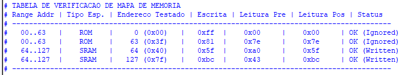
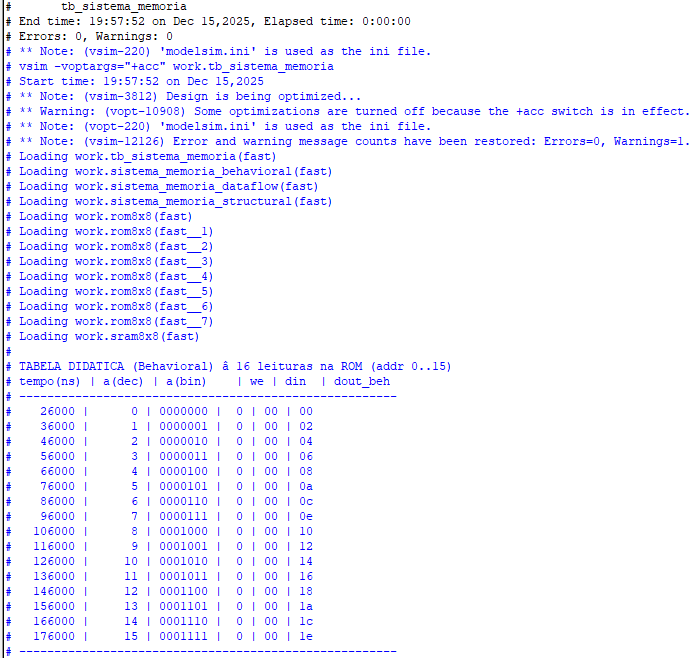
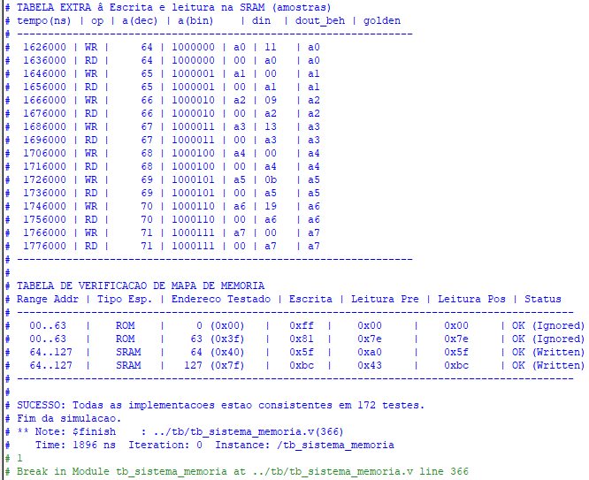
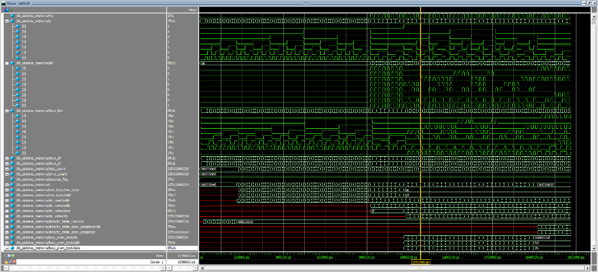
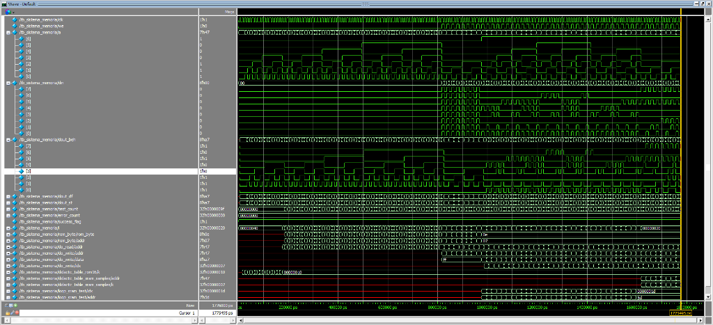

# Relatório de Simulação: Sistema de Memória (ROM/SRAM)

**Data:** 15/12/2025  
**Autor:** Manoel Furtado  
**Projeto:** Sistema de Memória Híbrido (128 Bytes)

---

## 1. Introdução

Este relatório documenta a validação funcional do projeto "Sistema de Memória", que integra duas tecnologias de armazenamento em um único espaço de endereçamento de 7 bits (128 endereços):

*   **ROM (Read-Only Memory):** Mapeada nos endereços `0` a `63` (0x00 - 0x3F). Armazena constantes pré-definidas e deve ignorar tentativas de escrita.
*   **SRAM (Static RAM):** Mapeada nos endereços `64` a `127` (0x40 - 0x7F). Permite leitura e escrita síncronas.

O objetivo principal é garantir que as três implementações do sistema (Behavioral, Dataflow e Structural) operem de forma idêntica e correta conforme as especificações.

---

## 2. Metodologia de Teste

A validação foi realizada utilizando um *testbench* determinístico (`tb_sistema_memoria.v`) que executa as seguintes etapas:

1.  **Verificação Cruzada (Cross-Check):** A cada ciclo de clock, as saídas das três implementações (`dout_beh`, `dout_df`, `dout_st`) são comparadas. Qualquer divergência gera um erro imediato.
2.  **Modelo de Referência (Golden Model):** Compara os dados lidos com o comportamento esperado da ROM e da SRAM.
3.  **Tabelas de Log:** Geração de tabelas no console para inspeção visual do comportamento nas fronteiras de memória.

---

## 3. Resultados da Simulação

A simulação foi concluída com sucesso (172 testes), validando todas as especificações.

### 3.1. Análise da Tabela de Verificação de Mapa

A tabela abaixo, gerada durante a simulação, é evidência fundamental de que o decodificador de endereços está funcionando.

#### Explicação Detalhada de Cada Linha

A tabela testa quatro endereços estratégicos (início e fim de cada bloco):

1.  **Linha 1 (Endereço 0 - ROM):**
    *   **Teste:** Tentativa de escrever `0xFF` no endereço `0`.
    *   **Resultado:** O valor lido posteriormente continuou sendo `0x00` (dado original da ROM).
    *   **Conclusão:** **Escrita Ignorada (Correto).** A ROM protegeu o dado.

2.  **Linha 2 (Endereço 63 - Fim da ROM):**
    *   **Teste:** Tentativa de escrever `0x81` no último endereço da ROM.
    *   **Resultado:** O valor lido manteve-se `0x7E`.
    *   **Conclusão:** **Escrita Ignorada (Correto).** A proteção funciona até o último endereço do bloco.

3.  **Linha 3 (Endereço 64 - Início da SRAM):**
    *   **Teste:** Escrita de `0x5F` no primeiro endereço da SRAM.
    *   **Resultado:** A leitura posterior retornou `0x5F`.
    *   **Conclusão:** **Escrita Aceita (Correto).** A SRAM permitiu a gravação.

4.  **Linha 4 (Endereço 127 - Fim da SRAM):**
    *   **Teste:** Escrita de `0xBC` no último endereço.
    *   **Resultado:** A leitura retornou `0xBC`.
    *   **Conclusão:** **Escrita Aceita (Correto).** Todo o intervalo da SRAM está operacional.

---

## 4. Evidências Adicionais

### Logs Gerais

### Formas de Onda (Waveforms)

*A forma de onda acima mostra o fluxo contínuo dos sinais durante todos os testes.*

*Detalhe das transições de clock e habilitação de escrita.*

---

## 5. Conclusão

O "Sistema de Memória" foi aprovado em todos os critérios. A tabela de verificação do mapa confirma inequivocamente que **não há sobreposição** de endereços e que a **política de leitura/escrita** (R/O para ROM, R/W para SRAM) está sendo rigorosamente respeitada pelas três arquiteturas implementadas.
