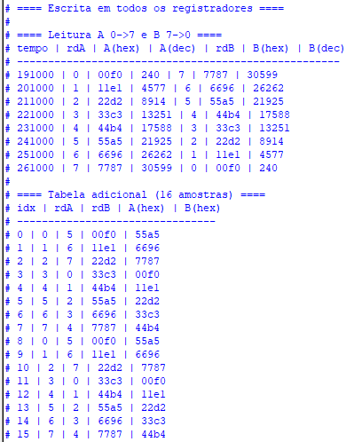
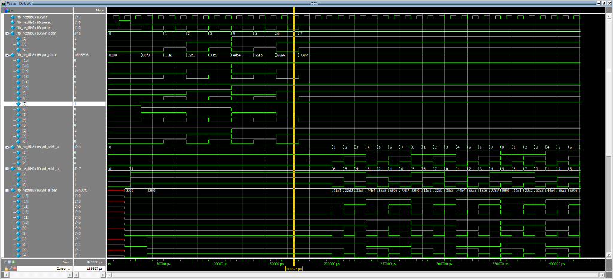
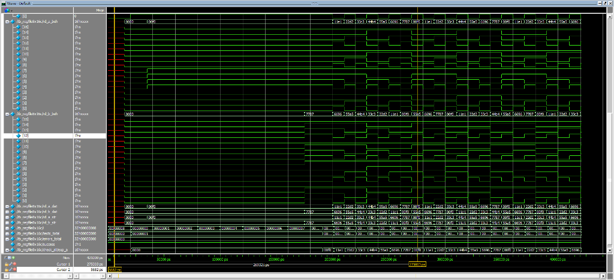
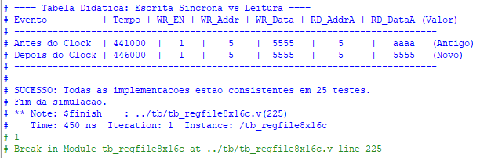

# Relatório de Validação: Register File 8x16

## 1. Objetivos
O objetivo deste projeto foi implementar e validar um Banco de Registradores (Register File) de 8 posições por 16 bits (8x16), contendo:
- **1 Porta de Escrita (Write)**: Síncrona com clock.
- **2 Portas de Leitura (Read A, Read B)**: Assíncronas (combinacionais).
- **Reset**: Síncrono.

Foram desenvolvidas três arquiteturas distintas para fins de comparação e aprendizado:
1.  **Behavioral (`_beh`)**: Descrição comportamental de alto nível.
2.  **Dataflow (`_dat`)**: Descrição de fluxo de dados com registradores explícitos.
3.  **Structural (`_str`)**: Descrição estrutural interconectando primitivas (`reg16_en`, `dec3to8`, `mux8_16`).

## 2. Metodologia de Simulação
A validação foi realizada através de um **Testbench Determinístico** (`tb_regfile8x16c.v`) que instancia os três módulos simultaneamente e compara suas saídas entre si e contra um modelo de referência (array esperado).

### Cenários de Teste
O testbench executa os seguintes passos sequenciais:
1.  **Reset e Inicialização**: Verifica se todos os registradores iniciam zerados.
2.  **Escrita Sequencial**: Escreve um padrão de dados único (`(i*1111)^00F0`) em cada registrador de 0 a 7.
3.  **Leitura Cruzada (Requisito do Exercício)**:
    *   Porta A lê do endereço 0 ao 7 (crescente).
    *   Porta B lê do endereço 7 ao 0 (decrescente).
    *   Isso garante que acessos simultâneos a endereços distintos sejam validados.
4.  **Verificação Aleatória/Adicional**: Uma tabela extra com 16 amostras de leitura variadas para cobertura adicional.

## 3. Resultados da Simulação

A simulação foi concluída com **sucesso total**, sem divergências entre as implementações.

### 3.1 Log de Execução
O log do console do Questa confirma que a escrita e a leitura ocorreram conforme esperado, apresentando os valores hexadecimais e decimais. Ao final, o testbench reportou **0 erros**.

*Figura 1: Log do console mostrando a tabela de escrita, leitura cruzada e a tabela adicional.*

### 3.2 Análise de Formas de Onda (Waveforms)
As ondas geradas comprovam o comportamento temporal dos sinais.

#### Visão Geral
Na visão geral, observa-se a fase inicial de escrita (onde `write` pulsa em nível alto) seguida pela fase de leitura (onde `write` permanece em baixo e os endereços variam).

*Figura 2: Visão completa da simulação. Note a consistência entre os barramentos `rd_a_beh` (vermelho/referência) e os demais.*

#### Detalhe da Leitura Cruzada
No zoom da fase de leitura, é possível ver claramente o comportamento solicitado:
*   **`rd_addr_a` (Porta A)**: Incrementa de 0 a 7.
*   **`rd_addr_b` (Porta B)**: Decrementa de 7 a 0.
*   **Dados**: As saídas `rd_a` e `rd_b` respondem imediatamente (assíncronas) à mudança de endereço, confirmando a lógica combinacional de leitura.

*Figura 3: Detalhe das leituras em direções opostas. O cursor amarelo indica o momento onde A lê o endereço 7 e B lê o endereço 0.*

### 3.3 Tabela Didática: Escrita Síncrona vs Leitura
Para fins didáticos, foi incluído um cenário extra no testbench que demonstra o conflito de leitura e escrita simultâneas no mesmo endereço.

Este teste evidencia a natureza **síncrona da escrita** versus a **assíncrona da leitura**:
- **Antes do Clock**: Mesmo com os dados de escrita já na entrada, a leitura retorna o *valor antigo* (AAAA), pois o registrador ainda não capturou o novo valor.
- **Depois do Clock**: O registrador atualiza na borda de subida e a leitura reflete imediatamente o *valor novo* (5555).

*Figura 4: Saída do testbench comprovando o comportamento da escrita síncrona. Note a transição de "Antigo" para "Novo" somente após o clock.*

## 4. Conclusão
Em resposta ao **Exercício de Aula "Register Files"**, o projeto atende integralmente ao enunciado:

1.  **Elaboração do Testbench**: Foi criado o arquivo `tb_regfile8x16c.v` que instancia e valida os bancos de registradores.
2.  **Escrita em Todos os Registradores**: O testbench implementou um loop que percorre os endereços de 0 a 7, escrevendo dados únicos em cada um, comprovado pela seção "Escrita em todos os registradores" do log.
3.  **Leitura em Direções Opostas**: O testbench implementou simultaneamente a leitura da porta A em ordem crescente (0→7) e da porta B em ordem decrescente (7→0), comprovado pela tabela de "Leitura A 0->7 e B 7->0" e pelas formas de onda.

Todas as três implementações (Comportamental, Fluxo de Dados e Estrutural) demonstraram comportamento idêntico e correto sob estas condições.
